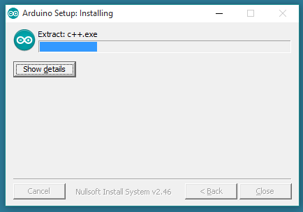
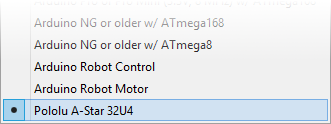

[NOTE]
====
Ok this is draft step number is all @!$$% up
====

= Lab Software install and laptop setup 

== Installing Windows drivers

1. Download the https://www.pololu.com/file/download/a-star-2.0.0.zip?file_id=0J743[A-Star Software and Drivers] (98k zip) and extract the ZIP file to a temporary folder on your computer. (remember where this is)

1. Open the “drivers” folder. Right-click on “a-star.inf” and select “Install”.

image::images\pololu_astar_001.png[]

1.  Windows will ask you whether you want to install the drivers. Click “Install” (Windows 8, 7, and Vista) or “Continue Anyway” (Windows XP).

image::images\pololu_astar_002.png[]

1.  Windows will not tell you when the installation is complete, but it should be done after a few seconds.

**Windows 10, Windows 8, Windows 7, and Windows Vista users:** After installing the drivers, your computer should automatically recognize the device when you connect it via USB. No further action from you is required. However, the first time you connect an A-Star device to your computer, Windows will take several seconds to recognize the device and configure itself properly. The first time you program the device, Windows will again take several seconds to recognize the A-Star USB bootloader, and this could cause the programming operation to fail the first time. Also, Windows will need to re-recognize the device and the bootloader if you connect the board to another USB port that it has not been connected to before.

=== COM port details

After installing the drivers and plugging in an A-Star, in the “Ports (COM & LPT)” category of the Device Manager, you should see a COM port for the A-Star’s named “Pololu A-Star 32U4”.

[need a picture here]

You might see that the COM port is named “USB Serial Device” in the Device Manager instead of having a descriptive name. This can happen if you are using Windows 10 or later and you plugged the A-Star into your computer before installing our drivers for it. In that case, Windows will set up your A-Star using the default Windows serial driver (usbser.inf), and it will display “USB Serial Device” as the name for the port. The port will still be usable, but it will be hard to tell if it is the right one because of the generic name shown in the Device Manager. We recommend fixing the names in the Device Manager by right-clicking on each “USB Serial Device” entry, selecting “Update Driver Software…”, and then selecting “Search automatically for updated driver software”. Windows should find the drivers you already installed, which contain the correct name for the port.

If you want to change the COM port numbers assigned to your A-Star, you can do so using the Device Manager. Double-click a COM port to open its properties dialog, and click the “Advanced…” button in the “Port Settings” tab.

== Install the Arduino Software (IDE)

=== Download the Arduino Software (IDE)

Get the latest version from the https://www.arduino.cc/en/Main/Software[download page]. You can choose between the Installer (.exe) and the Zip packages. We suggest you use the first one that installs directly everything you need to use the Arduino Software (IDE), including the drivers. 

When the download finishes, proceed with the installation and please allow the driver installation process when you get a warning from the operating system.

image::images/DRV_Capture1a.png[]

Choose what to install

image::images/DRV_Capture2.png[]

Choose the installation directory (we suggest to keep the default
one)

The process will extract and install all the required files to execute properly the Arduino Software (IDE)

=== Proceed with board specific instructions

Let install Pololu A-star 32U4 Board A-Star Software and Drivers

 1. So we already, download the https://www.pololu.com/file/download/a-star-2.0.0.zip?file_id=0J743[A-Star Software and Drivers] (98k zip). and extract the ZIP file to a temporary folder on your computer. When we did the driver install. Copy the “pololu” folder from the downloaded “add-on” folder into the **[sketchbook location]/hardware** folder. ou can see the sketchbook location in the Arduino IDE Preferences dialog, which is available from the File menu. For a typical user, the sketchbook location will be a folder named Arduino inside the Documents folder. For a typical user running a recent version of Windows, the “pololu” folder should be installed in this location:   

[NOTE]
====
**C:\Users\<username>\Documents\Arduino\hardware\pololu**
==== 

1.  If the “Arduino” or “hardware” directories do not exist yet, you will need to create them.
2.  Close the Arduino IDE if it is open, and then restart it.
3.  In the **Tools > Board** menu, select the “Pololu A-Star 32U4” entry. If you do not see your device listed in the Board menu, then the add-on is probably not installed correctly. Try doing step 2 again and restarting the Arduino IDE.

